# here is 7by24👋

### Engineering:
With over 10+ years of hands-on experience building, scaling, and hardening mission-critical infrastructure, I specialize at the intersection of Site Reliability Engineering (SRE), DevOps transformation, and software development. My career has been defined by a single principle: systems should be resilient by design, not by accident.

Site Reliability Engineering: Led SRE initiatives for high-traffic platforms serving millions of daily active users, driving service-level objectives (SLOs) and error budgets that reduced critical incidents by 60% while maintaining 99.99% uptime. Architected incident response frameworks, post-mortem cultures, and chaos engineering practices that turned reliability from a reactive burden into a competitive advantage.

Software/Ops Engineering: Strong foundation in programming and automation. Proficient in Python, Vue3 and Typescript for building website, APP, miniprogram and etc.

### Leadership & Impact
Beyond technical execution, I've built and mentored cross-functional SRE and platform teams, fostering a culture of blameless post-mortems, continuous improvement, and data-driven decision making. I bridge the gap between engineering and business stakeholders, translating technical reliability metrics into board-level risk assessments and cost-optimization strategies.

### Current Focus
Today, I'm focused on AI-augmented operations, platform engineering at scale, and green computing—exploring how intelligent automation and sustainable infrastructure practices can reduce operational toil while minimizing environmental impact.

### Open to work
I am currently open to opportunities in platform architecture, SRE leadership, and infrastructure strategy for organizations ready to treat reliability as a product feature.

<!--
**7by24/7by24** is a ✨ _special_ ✨ repository because its `README.md` (this file) appears on your GitHub profile.

Here are some ideas to get you started:

- 🔭 I’m currently working on ...
- 🌱 I’m currently learning ...
- 👯 I’m looking to collaborate on ...
- 🤔 I’m looking for help with ...
- 💬 Ask me about ...
- 📫 How to reach me: ...
- 😄 Pronouns: ...
- ⚡ Fun fact: ...
-->
 
<!--  -->

